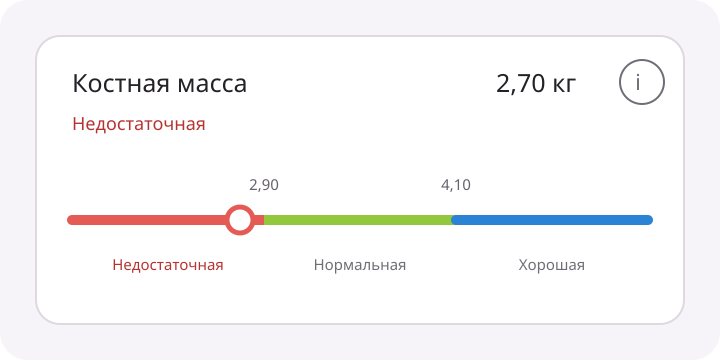

# Issue #78 — шкала отображения нормы

Утверждено владельцем 31 августа 2026 года. Пакет фиксирует дизайн горизонтальной шкалы норм для развёрнутых карточек показателей.

## Scope

Шкала заменяет вертикальный список диапазонов в:

- сводке последнего измерения;
- развёрнутой записи истории;
- предпросмотре несохранённого измерения.

Компактные четыре показателя верхней сводки, графики, расчёты норм, порядок показателей и диалог справки не меняются.

## Структура карточки

1. Название показателя, текущее значение с единицей и info-кнопка 48×48 dp.
2. Текстовый статус категории.
3. Числовые границы над цветной полосой.
4. Контрастный круглый маркер, центрированный по высоте полосы.
5. Названия зон под полосой.

Каждая зона занимает равную визуальную ширину: открытые крайние интервалы не изображаются как бесконечная числовая ось. Для конечного текущего интервала маркер пропорционален значению; в открытом интервале занимает устойчивую позицию внутри крайнего сегмента. На границе используется категория существующего классификатора.

Цвета берутся из `ReferencePalette`. Текущая зона дополнительно выделяется маркером, цветным текстом и medium-начертанием; смысл всегда продублирован текстовым статусом.

## Компактная типографика

Границы и названия зон всегда используют `labelSmall` / `bodySmall`. Компонент не повышает их до `bodyMedium` или `title*`. Системный font scale Android сохраняется.

## Адаптивность

- Группа с показателем, содержащим 4+ зоны, всегда отображается в одну колонку.
- При ширине шкалы менее 320 dp или font scale ≥ 1.3 границы чередуются в двух строках над полосой: нечётные стыки находятся в верхней строке, чётные — в нижней. Каждая граница однострочная, центрирована на стыке, ограничена шириной двух соседних половин сегмента и не пересекается с соседней.
- Названия зон допускают максимум две строки.
- При невозможности разместить длинное название используется существующее короткое имя; полное имя и диапазон остаются в semantics и справке.
- Горизонтального скролла нет.

## Состояния

- Rated: значение, статус, границы, шкала, маркер и подписи.
- Preliminary: существующая пометка сохраняется; шкала строится по рассчитанным зонам.
- Missing/unavailable/out-of-domain/missing profile data: причина сохраняется, шкала не показывается.
- Empty/loading/error остаются экранными состояниями без отдельного состояния шкалы.

## Accessibility

Карточка произносит название, значение, статус и последовательность зон с диапазонами. Шкала read-only и не становится отдельным фокусируемым контролом. Визуальные подписи исключаются из дерева, если полное описание уже задано контейнеру. Info-кнопка сохраняет отдельное описание и возврат фокуса после закрытия диалога.

## Flavors

Одинаковое поведение в personal и huaweiEnterprise; реализация находится в общем source set и не добавляет Huawei-зависимостей.

## Приёмка

- Шкала используется во всех трёх развёрнутых представлениях.
- Порядок, названия и границы совпадают с существующей классификацией.
- Маркер совпадает с текстовым статусом, включая границы и открытые интервалы.
- Недоступные значения не показывают шкалу.
- Верхняя компактная сводка и справочный диалог не меняются.
- Нет перекрытий при 5 зонах, ширине 320 dp и font scale 1.3.
- Светлая/тёмная темы читаемы без опоры только на цвет.
- TalkBack получает полное недублированное описание.

## Источники

- GitHub issue: https://github.com/ilguit/XiaomiScaleSync/issues/78
- Референс Zepp Life приложен владельцем к issue.
