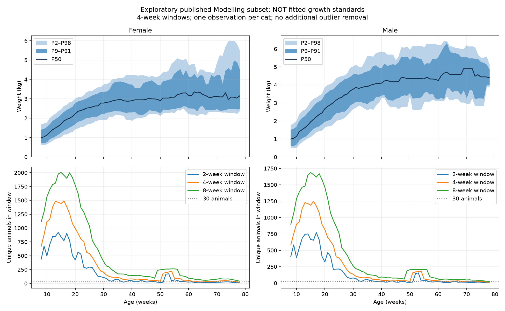

# №97 — исследование кривых веса домашних кошек

Обновлено: 2026-09-05. [Issue №97](https://github.com/ilguit/XiaomiScaleSync/issues/97).

## Задача и текущее состояние

Пользователь запросил сначала поиск и сбор данных, затем исследование нижней и верхней
кривой по возрасту и полу. Последним сообщением явно разрешено сохранять исследования
в отдельной папке docs. Это исследовательский пакет, не реализация задачи в приложении
и не утверждённый технический или UI-план. Формулировка issue «от веса и пола»
интерпретирована как «от возраста и пола»; явного исправления описания пока нет.

Сохранены источники, метод расчёта, аудит настоящего CSV и первые эмпирические полосы.
Модель GAMLSS/BCCG ещё НЕ обучена; коэффициенты оригинальной модели не найдены
в проверенных материалах. Полосы в этом каталоге нельзя называть опубликованными
стандартами или переносить в приложение как утверждённую норму.

## Подтверждённые продуктовые решения

- Канонический термин — **«Типичный диапазон веса»**: справочная информация,
  которая не оценивает здоровье питомца.
- Для кошек с «Другой породой» используется DSH-профиль как популяционный ориентир,
  независимо от стерилизации; модель выбирается по полу. Без пола или даты рождения
  диапазон не показывается.
- Runtime-зона — P9–P91 с тонкой медианой P50, отдельно для самок и самцов.
  P2/P98 остаются в исследовательских данных для аудита.
- До первой доступной точки диапазон отсутствует. Между точками значения
  интерполируются линейно, отображение визуально сглаживается. После последней
  точки последнее значение удерживается бессрочно. Правило едино для породных
  справочников кошек и собак и собачьих весовых категорий.
- Для частичной даты рождения границы объединяются по всему возможному интервалу возраста.
- В интерфейсе остаётся существующее оформление зоны; легенда использует новый термин,
  accessibility-описание сообщает справочный смысл, ссылка ведёт на DOI публикации.
- Для 0–8 недель нужен отдельный совместимый DSH-набор. Найдены публикации и ориентиры,
  но не численные перцентильные данные, совместимые с P9/P50/P91. Если такие данные
  не будут найдены, этот возраст останется документированным пробелом.
- Допустима независимо воспроизведённая BCCG-модель после визуальной проверки,
  калибровки и проверки формы. Из нескольких прошедших моделей выбирается более простая.

## Источники и применимость

| Источник | Что использовать |
| --- | --- |
| [Salt et al., 2022, PLOS ONE 17(11):e0277531](https://journals.plos.org/plosone/article?id=10.1371/journal.pone.0277531) | Основная модель: здоровые sexually-intact Domestic Shorthair, отдельные кривые по полу, 8–78 недель. Финальная выборка 7 090 животных / 14 215 измерений. |
| [DataCat 1456](https://datacat.liverpool.ac.uk/1456/) | CSV наблюдений и README, CC BY 3.0. Авторы German, Salt, Butterwick; источник University of Liverpool / Waltham / Banfield. При использовании сохранить атрибуцию и обозначить преобразования. |
| [README CSV](https://datacat.liverpool.ac.uk/1456/2/AUTHOR_DATASET_ReadmeTemplate.txt) | Описание групп и полей; обнаружены неточности, см. ниже. |
| [Salt et al., 2017](https://journals.plos.org/plosone/article?id=10.1371/journal.pone.0182064) | Методическая ссылка из статьи о кошках: pb()-сплайны, подбор сглаживания, диагностика. Не источник чисел кошачьего веса. |
| [Исправление статьи 2017 года](https://journals.plos.org/plosone/article?id=10.1371/journal.pone.0314711) | Учитывать при дальнейшем изучении методической работы. |
| [Документация BCCG](https://search.r-project.org/CRAN/refmans/gamlss.dist/html/BCCG.html) | Расчёт квантилей qBCCG(p, mu, sigma, nu). |
| [Salt et al., 2023](https://pubmed.ncbi.nlm.nih.gov/36920976/) и [DataCat 1459](https://datacat.liverpool.ac.uk/1459/) | Стерилизация меняет траекторию, эффект зависит от пола и возраста операции. Не обосновывает фиксированную поправку ко всем весам. |
| [University of Guelph, 2019](https://news.uoguelph.ca/2019/07/u-of-g-researchers-first-to-track-how-cats-weight-changes-over-time/) | 54 млн измерений / 19 млн кошек; наблюдаемый вес в течение жизни, не здоровая эталонная кривая. |
| [WSAVA](https://wsava.org/wp-content/uploads/2020/01/Frequently-Asked-Questions-and-Myths.pdf) | Идеальный вес связан с упитанностью конкретного животного. |

Перенос DSH на всех беспородных кошек, длинношёрстных, неизвестные породы или
стерилизованных животных не подтверждён основной моделью. Экстраполяция за 8–78 недель
не исследована. P9–P91 охватывает центральные 82% распределения, P2–P98 — 96%.
Это не доверительные интервалы и не диагностические пороги. Выбор полосы пока не утверждён.

## Проверка настоящего файла — новые результаты

Скачан [KGC1_dataset.csv](https://datacat.liverpool.ac.uk/1456/1/KGC1_dataset.csv).
SHA-256: `76be97fd71d5139fb648e58c69db58945c221df33f1b7f15fc12e244db90e094`.
Хеш совпал с уже закреплённым в `tools/weight-references/weight_references.source.json`.
CSV содержит 93 899 строк; фактическое поле пола — `Sex`, не `SEX`, как в README.

| Modelling | Строки | Уникальные животные |
| --- | ---: | ---: |
| F | 7 961 | 3 987 |
| M | 6 254 | 3 103 |

Эти четыре числа точно совпадают с FINAL DATA в Table 1 статьи. Поэтому прежнее
предположение, что к CSV обязательно нужно заново применить всю очистку, пересмотрено.
README называет данные raw, но сравнение численности указывает на уже очищенную
выборку. Это сильное свидетельство, не доказательство идентичности каждой строки.
До дополнительного подтверждения не удалять выбросы повторно автоматически.

После ограничения возрастом 8–78 недель: F — 7 050 строк / 3 518 животных;
M — 5 628 / 2 779. Это ограничение исследовательского графика, а не доказательство
того, что авторы ограничивали обучающую выборку тем же диапазоном. Для GAMLSS
нужно сохранить более широкий диапазон Modelling и отдельно ограничивать вывод.

## Выполненный численный эксперимент

`analyze.py` вычисляет P2/P9/P25/P50/P75/P91/P98 с линейной интерполяцией
по позиции `(N−1)*p`. Возраст: `Visit_Age_Yrs * 365.25 / 7`.
Центры: каждая целая неделя 8–78. Ширины окон: 2, 4 и 8 недель, края ограничены
диапазоном исследования. Сравниваются все визиты и один ближайший к центру визит
на животное в каждом окне; при равенстве расстояний выбирается меньший возраст,
затем меньший вес. Это исследовательская проверка повторных измерений,
не способ обучения авторской модели. Соседние окна перекрываются, животное может
попадать в несколько окон. Никакой дополнительной очистки выбросов не выполнено.

Выходы:

- `audit.json` — хеш, численность исходных групп и плотность окон.
- `empirical-bands.csv` — 852 строки: 2 пола × 3 окна × 71 возраст × 2 режима.
- `empirical-bands.png` — P9–P91 и P2–P98 для окна 4 недели, один визит на кошку;
  снизу число животных для трёх ширин окна.

| Пол | Животных в окне 4 недели у центра 78 | Центров с <30 животными (из 71) |
| --- | ---: | ---: |
| F | 21 | 4 |
| M | 12 | 14 |

Максимальный разброс границы между окнами 2/4/8 недель, один визит на животное:
у F — P2 0,692 кг, P9 0,478 кг, P91 0,754 кг, P98 0,874 кг;
у M — P2 1,166 кг, P9 0,890 кг, P91 0,519 кг, P98 1,026 кг.
Это чувствительность к выбору окна, НЕ оценка погрешности или доверительный интервал.
Порог 30 — диагностический ориентир из существующего генератора, не критерий
надёжности P2. Поле centres_below_250 также только диагностическое: при N=250
в 2%-хвосте в среднем лишь 5 наблюдений; N=250 не гарантирует точности.

Вывод: соединение локальных перцентилей даёт нестабильные границы в редких возрастах.
Результат поддерживает необходимость сглаженной распределительной модели и проверки
устойчивости. Он не определяет автоматически оптимальную ширину конечной полосы.



## Метод следующего эксперимента и открытые вопросы

В статье: по модели GAMLSS/BCCG на каждый пол, возраст в степени 0,1.
В методической ссылке: penalised splines `pb()`, подбор сглаживания между AIC и SBC,
диагностика остатков и worm plots, приоритет защиты от переобучения.
Итоговые настройки по кошкам и сериализованные модели не обнаружены.

После обучения для сетки возрастов предсказываются mu, sigma, nu, затем:

```r
qBCCG(c(0.02, 0.09, 0.50, 0.91, 0.98), mu, sigma, nu)
```

Код выше относится к одному возрасту/полу, не содержит обученной модели.
Использовать qBCCG, учитывающую усечение распределения, а не безусловно подставлять
обычный нормальный квантиль в упрощённую LMS-формулу.
Статья описывает округлённые перцентильные подписи и равные шаги z=0,67;
при сопоставлении оригинальных линий проверить, использованы ли точные вероятности
0,02/0,09 или соответствующие z-значения. Наш эмпирический эксперимент использует
именно 0,02/0,09/0,91/0,98.

Чтобы продолжить без потери контекста:

1. Подготовить изолированную среду R/gamlss: Rscript сейчас отсутствует в PATH.
2. Использовать опубликованную Modelling без повторной очистки как базовый сценарий;
   сохранить все доступные возраста для обучения. Подбор сглаживания документировать.
3. Сравнить предсказания с Fig 1 публикации, не выдавая оцифровку изображения за точные данные.
4. Проверить P2≤P9≤P50≤P91≤P98, положительность, поведение краёв,
   калибровку по возрасту и устойчивость к сглаживанию; разбиение и bootstrap — по Cat_ID.
5. Отдельно оценить повторы измерений. Сглаживание не устраняет неопределённость редких возрастов.
6. Только после этого выбрать полосу для будущего продукта. Авторские коэффициенты
   можно запросить у исследователей, но переписка не начиналась.

## Воспроизведение и окружение

Python 3.12.14; matplotlib 3.11.1. Численные перцентили считают только стандартные
библиотеки Python. Для воспроизведения установить matplotlib во внешнее venv,
скачать CSV по ссылке выше, затем:

```sh
python docs/research/97/analyze.py /path/KGC1_dataset.csv
```

Скрипт проверяет хеш, пересоздаёт три выходных файла и проверяет порядок перцентилей.
В текущей сессии venv: `/tmp/issue97-py312`; исходник: `/tmp/issue97-KGC1_dataset.csv`.
Временные пути могут исчезнуть; воспроизведение не должно зависеть от их сохранности.
Индивидуальные записи животных в docs не копируются; сохраняются агрегаты.

Существующий генератор `tools/weight-references` уже использует этот же источник
для эмпирических P25/P50/P75, с минимумом 30 наблюдений в недельном бине.
Он явно не воспроизводит GAMLSS. Его данные и код в рамках исследования не менялись.
В его библиографии замечено `17(12)`; на странице статьи — `17(11)`.
Исправление производственного источника отложено до отдельного разрешённого этапа.
